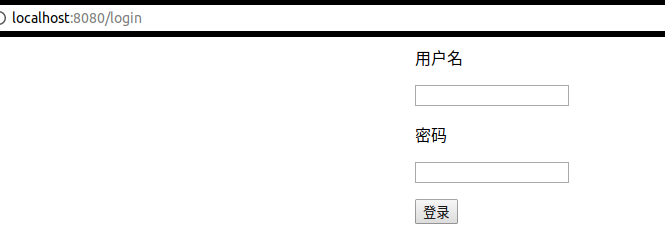
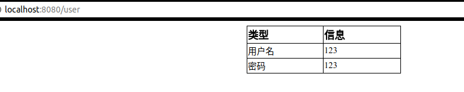

### cloudgo-io
服务计算作业用 Go 开发 web 应用程序 cloudgo-io
### 要求
#### 基本要求
<li>支持静态文件服务</li>
<li>支持简单 js 访问</li>
<li>提交表单，并输出一个表格</li>
<li>对 /unknown 给出开发中的提示，返回码 5xx</li>
</br>
#### 提高要求
<li>分析阅读 gzip 过滤器的源码（就一个文件 126 行）</li>
<li>编写中间件，使得用户可以使用 gb2312 或 gbk 字符编码的浏览器提交表单、显示网页。（服务器模板统一用 utf-8）</li>
</br>
#### 实现情况
a.首先是静态文件服务
```
caijh@caijh-PC:~$ curl -v http://localhost:8080/static/css/login.css
*   Trying ::1...
* Connected to localhost (::1) port 8080 (#0)
> GET /static/css/login.css HTTP/1.1
> Host: localhost:8080
> User-Agent: curl/7.47.0
> Accept: */*
> 
< HTTP/1.1 200 OK
< Accept-Ranges: bytes
< Content-Length: 290
< Content-Type: text/css; charset=utf-8
< Last-Modified: Tue, 21 Nov 2017 12:43:45 GMT
< Date: Thu, 23 Nov 2017 14:14:44 GMT
< 
#container{
	width : 40%;
	height : 450px;
	margin-left : auto;
	margin-right : auto;
	border-radius : 20px;
}
#myForm{
	width : 50%;
	height : 450px;
	margin-left : auto;
	margin-right : auto;
	border-radius : 20px;
}
#myForm p {
	text-align : left;
	font-family : Arial;
	color : black;
* Connection #0 to host localhost left intact
}
```
b.支持简单的js访问
```
caijh@caijh-PC:~$ curl -v http://localhost:8080/js
*   Trying ::1...
* Connected to localhost (::1) port 8080 (#0)
> GET /js HTTP/1.1
> Host: localhost:8080
> User-Agent: curl/7.47.0
> Accept: */*
> 
< HTTP/1.1 200 OK
< Content-Type: application/json; charset=UTF-8
< Date: Thu, 23 Nov 2017 14:17:01 GMT
< Content-Length: 38
< 
{
  "now": "2017-11-23 22.17.01 PM"
}
* Connection #0 to host localhost left intact
```
提交表单并输出一个表格</br>
这里我通过浏览器验证


</br>
对 /unknown 给出开发中的提示，返回码 5xx
```
caijh@caijh-PC:~$ curl -v http://localhost:8080/unknown
*   Trying ::1...
* Connected to localhost (::1) port 8080 (#0)
> GET /unknown HTTP/1.1
> Host: localhost:8080
> User-Agent: curl/7.47.0
> Accept: */*
> 
< HTTP/1.1 501 Not Implemented
< Content-Type: text/plain; charset=utf-8
< X-Content-Type-Options: nosniff
< Date: Thu, 23 Nov 2017 14:20:10 GMT
< Content-Length: 25
< 
501 page not implemented
* Connection #0 to host localhost left intact
```
#### 拓展任务
对于拓展任务我写了博客，然后gbk转码代码还未测试，这边是代码链接https://github.com/caijh23/goWeb/tree/master/web/negroni-gbk，这边是博客链接
